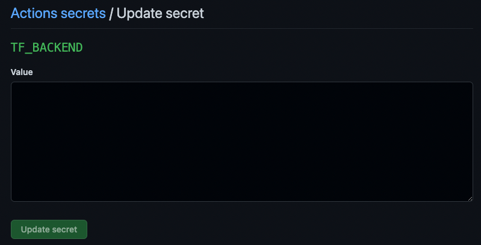
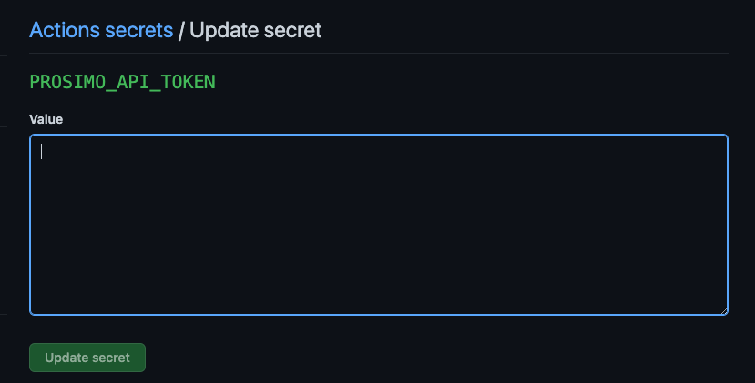

# Prosimo DevOps/POC Starter

# Contents
- [Introduction](#introduction)
- [Prerequisites](#prerequisites)
- [Quick Start](#quick-start)
    - [Default Deployment](#default-deployment)
    - [Custom Deployment](#custom-deployment)
- [Detailed Instructions](#detailed-instructions)
    - [Repository Structure](#repository-structure)
    - [Terraform State](#terraform-state)
    - [GitHub Secrets](#github-secrets)
    - [Unit Tests](#unit-tests)
    - [Files and Triggers](#files-and-triggers)
    - [Testing Existing Items](#testing-existing-items)
    - [VS Code Snippets](#vs-code-snippets)
    - [Dealing with Errors](#dealing-with-errors)
    - [Default Deployment Details](#default-deployment-details)


---

# Introduction

This repository contains pre-built GitHub Actions that will build sample infrastructure to test a Prosimo deployment in your environment. The actions are re-usable and may continue to be used beyond the intial testing phases if desired. It is typically recommended to test real applications and networks as part of a POC, and while advised it is not a requirement. 

---

# Prerequisites

1. A Prosimo team and access to the Prosimo portal
2. Cloud accounts with proper IAM roles in AWS, Azure, and GCP pre-configured in the Prosimo portal
3. A primary IDP provider configured in the Prosimo portal [^1]
4. Cloud credentials with enough access to provision compute and network resources in all 3 cloud providers [^2]
   
---

# Quick Start
   
Following the steps outlined below is the fastest way to start testing with a pre-built set of services deployed across a multi-cloud environment. The majority of the initial work is setting environment secrets to allow workflow runs to execute in your cloud accounts. However, once this initial setup is complete, the workflows are highly automated, customizable, and provide an entry point for management and governance via Infrastructure-as-Code (IaC).

---

1. Create Personal Access Token (PAT)

Follow [this step](https://docs.github.com/en/authentication/keeping-your-account-and-data-secure/creating-a-personal-access-token#creating-a-token) to create a PAT with 'repo' permissions. Once that is completed create a GitHub Action Secret named: `TF_BACKEND`, paste your PAT value, and update the secret. 



---

2. Create GitHub Secrets

Run the `Create Secrets` GH Action workflow  

---

3. Update Secret Values

Add the appropriate values for each of the created secrets. The following table list the secrets required for each cloud you wish to deploy.

 | Secret  | AWS  | Azure| GCP | Prosimo | 
 | ------------- | :---: | :---: | :---: | :---: | 
 | ARM_CLIENT_ID |  | X |  | | 
 | ARM_CLIENT_SECRET |  | X |  | | 
 | ARM_SUBSCRIPTION_ID |  | X |  | | 
 | ARM_TENANT_ID |  | X |  | | 
 | AWS_ACCESS_KEY_ID | X |  |  | | 
 | AWS_SECRET_ACCESS_KEY | X |  |  | | 
 | GCP_SA_EMAIL |  | | X | | 
 | GCP_SA_KEY | | | X | | 
 | PROSIMO_API_TOKEN |  | |  | X |
 | PROSIMO_TEAMNAME | |  |  | X |
 | VM_PASSWORD | X | X | X | |

---

6. Edit Config File

Edit the regions, cloud, and IP addresses you want allowed for that cloud and region.

---

4. Create Terraform Backend

Run the Terraform Backend GH Action workflow for your preffered cloud back-end.

---

5. Create Branch

---

6. Edit Config File

Edit the regions, cloud, and IP addresses you want allowed for that cloud and region.

---

7. Commit Change to Branch

---

8. Issue Pull Request

---

## Default Deployment


In order to start leveraging this repo, and the workflow automation it brings, you first need to create an API key in the Prosimo portal. API tokens can be generated from the link below; replacing `<teamName>` with your assigned Prosimo team name.
  
> https://`<teamName>`.admin.prosimo.io/dashboard/management/api-tokens

Once this token is generated navigate to the secrets portion of this repo which can be found at the path below by changing `<yourOrg>` and `<yourRepoName>` to the values of your GitHub user/org and the name you gave when using the template.

> /`<yourOrg>`/`<yourRepoName>`/settings/secrets/actions  
  
Set the value for PROSIMO_API_TOKEN to be the API key generated above, and then click `Update secret` to save the change.  

  
  
This secret is all that is needed to allow Prosimo orchestration capabilities across connected cloud environments. In order to build sample environments in different cloud providers it is necessary to have cloud credentials to leverage the Terraform builds provided in the automation pipelines. The table below shows which secrets are required to deploy in each cloud.

 ---

Once the required credential secrets have been added to the repo you can either manually trigger the initial pipeline to build the full environment with default settings, or you can edit the [prosimo-config.json](prosimo-config.json) and adjust the supplied values. The pre-built environment will deploy a total of 6 Prosimo Edges. Edges for AWS will be deployed in us-west-1 and eu-west-1, Azure in eastus and eastasia, and GCP in us-central1 and europe-central2.   


---

## Custom Deployment


---

# Detailed Instructions

This repository contains pre-built GitHub Actions that will build sample infrastructure to test a Prosimo deployment in your environment. The actions are re-usable and may continue to be used beyond the intial testing phases if desired. It is typically recommended to test real applications and networks as part of a POC, but while advised it is not a requirement.  

---

## Repository Structure

---

 | Folder  | Purpose |
 | ------------- | ------------- |
 | [.github](.github/) | GitHub Actions CI pipelines |
 | [.vscode](.vscode/) | VS Code Snippets for Prosimo Terraform provider to ease template authoring |
 | [Assets](Assets/) | Optional deployment settings and items related to the repo (image storage, Terraform backend configuration, etc.) |
 | [Examples](Examples/) | Pre-built Terraform templates to build environments tied to GitHub Action CI pipelines |

---

## Terraform State  
  
---  
   
It is not recommended to store [Terraform state](https://www.terraform.io/language/state) in a code repository, however --in order to simplify deployment-- Terraform state is stored in the repo by default. To avoid state file conflicts or corruption it is recommended this repo only be used by a single user. If you wish to change this behavior there are provided pipelines [here](Assets/Backend/) that will create the necessary configuration to store state files in a proper backend. Once a cloud backend has been configured all existing pipeline runs that were executed prior to setting a backend should be re-run in order to migrate state. If this was configured before any runs no further action is required. 


---  
   
This repo was designed to make it as easy as possible to build and test a Prosimo deployment with minimal input. Automation triggers are built into this project, and editing certain files will trigger pipeline runs. 

 | File  | Purpose |
 | ------------- | ------------- |
 | terraform.tfvars | Settings file for pre-built environments that can be edited from the default values |
 | [prosimo-config.json](prosimo-config.json) | This file serves as the starting point for setting up your environment. The values provided here define the nickname of the cloud account onboarded in the Prosimo portal, IP ranges for Prosimo edges, clouds regions, and the CIDR ranges allowed for deployments. |

 Editing the default `prosimo-config.json` as shown below would result in 2 Prosimo edges deployed into an AWS account with the nickname `ProsimoPOC` in `us-west-1` and `eu-west-1`. 2 VPC's would be created for the edge deployment --each with a /23 address range-- from the CIDR `172.16.10.0/20`.  
 
 Any Terraform template deployed from this repo using a pre-built pipeline will validate the resource being is in a valid range for that region. 
 
 - ### Example 1: 
    
    > An EC2 instance in us-west-1 with an IP address of `10.10.0.10` would fail to deploy as the pipeline automation would validate against the defined range of `10.50.0.0/16`.

 - ### Example 2: 

    > An EC2 instance in us-west-1 with an IP address of `10.51.0.10` would fail to deploy as the `10.51.0.0/16` range is only allowed in `eu-west-1`. 

```json

{
    "cloudNickname": {
        "AWS":      "ProsimoPOC"
    },
    "edgeCIDR": {
        "AWS":      "172.16.10.0/20"
    },
    "idp": {
        "name": "okta"
    },
    "regions": {
        "AWS": [
            {
                "region": "us-west-1",
                "allowedCIDR": "10.50.0.0/16"
            },
            {
                "region": "eu-west-1",
                "allowedCIDR": "10.51.0.0/16"
            }   
        ]    
    } 
}

```
  
---  

## Unit Tests

 | Test Name | File(s) to Test | Test | Purpose |
 | --- | --- | --- | --- | 
 | should be a valid CIDR | terraform.tfvars | Checks that IP addresses defined are valid | Prevent deployment from failing due to an invalid IP |
 | should have a matching region defined in prosimo-config.json | terraform.tfvars, prosimo-config.json | Checks the region in terraform.tfvars for deployment against configured Prosimo edge regions defined in prosimo-config.json | Edges should be pre-defined as they take ~30 minutes to create, and this prevents deployment to a region without an edge |
 | should be in an allowed CIDR range for cloud region | terraform.tfvars, prosimo-config.json | Checks that IP addresses in terraform.tfvars match allowed region defined in prosimo-config.json | Allows validation of logically defined CIDR per-cloud region preventing deployment of network address space that shoould not be used |
 | should be a valid cloud region | terraform.tfvars | Checks that cloud region is valid by comparing configured region(s) against cloud region API call | Validates configured cloud region is valid to prevent deployment failures to a non-existent location  |
 | should be valid json | prosimo-config.json | Validates file is proper JSON | Prevent deployment errors by ensuring config file can be read and processed | 
 | shoud have required fields | prosimo-config.json | Validates all the proper JSON fields are present in config file | Ensures if the config file is modified that required fields are present for successful run | 
 | should have at least 1 cloud configured | prosimo-config.json | Checks that at least 1 cloud account is defined in config file | Validate at least 1 cloud account is configured as this is required for deployment | 
 | should be a valid CIDR for Edge | prosimo-config.json | Tests that CIDR range configured is valid  | Prosimo Edges pull IP addressing from configured CIDR ranges and this confirms the defined IP's are valid | 
 | should be a valid IDP | prosimo-config.json | Tests that configured IDP is an allowed type | A valid IDP is required to onboard user-to-app applications and deployments would fail if not configured | 
 | should have an edge CIDR defined for cloud | prosimo-config.json | Tests that a configured cloud account has a matching configured edge CIDR | If a cloud account is configured it is required to have a pre-defined CIDR range to create a Prosimo Edge in that CSP | 


---   

## Sample Environments

Default Prosimo Edge Deployment

> PaaS K8s price estimates include any master node charges along with the node compute costs


### Multi-Cloud 6 Region Deployment  

--- 
   
 | Resource  | Cloud | Compute Type | Quantity | Region | PAYG Cost | 1Year RI | 3Year RI
 | ------------- | ------------- | ------------- | ------------- | ------------- | ------------- | ------------- | ------------- |
 | Prosimo Edge (EKS) | AWS | t3.medium | 4 | us-west-1 | $232.23 | $178.50 | $149.89 |
 | Prosimo Edge (EKS) | AWS | t3.medium | 4 | eu-west-1 | $219.35 | $170.00 | $143.72 |
 | Prosimo Edge (AKS) | Azure | Standard_F2s_v2 | 4 | eastus2 | $249.43 | $148.40 | $92.95 |
 | Prosimo Edge (AKS) | Azure | Standard_F2s_v2 | 4 | eastasia | $289.28 | $171.46 | $110.66 |
 | Prosimo Edge (GKE) | GCP | e2-standard-2 | 4 | us-central-1 | $264.96 | $195.27 | $160.05 |
 | Prosimo Edge (GKE) | GCP | e2-standard-2 | 4 | europe-central2 | $324.10 | $230.82 | $185.44 |
 | Total | Multi-Cloud | 48vCPU x 96GB | 24 | Global | $1,579.35 | $1,094.45 | $842.71 | 

--- 

### Multi-Cloud 3 Region Deployment

--- 

 | Resource  | Cloud | Compute Type | Quantity | Region | PAYG Cost | 1Year RI | 3Year RI
 | ------------- | ------------- | ------------- | ------------- | ------------- | ------------- | ------------- | ------------- |
 | Prosimo Edge (EKS) | AWS | t3.medium | 4 | eu-west-1 | $219.35 | $170.00 | $143.72 |
 | Prosimo Edge (AKS) | Azure | Standard_F2s_v2 | 4 | eastus2 | $249.43 | $148.40 | $92.95 |
 | Prosimo Edge (GKE) | GCP | e2-standard-2 | 4 | europe-central2 | $324.10 | $230.82 | $185.44 |
 | Total | Multi-Cloud | 24vCPU x 78GB | 12 | Global | $792.88 | $549.22| $422.11 | 

 	 	 
---

The following sections highlight pre-built infrastructure you can use to quickly test different features on the platform. These deployments will create resources in your cloud environment and onboard them into the Prosimo platform.

---

## Default Basic Deployment

 | Cloud  | Region | VNet/VPC Name | CIDR | VM Name | VM Username |
 | ------------- | ------------- | ------------- | ------------- | ------------- | ------------- |
 | AWS | us-west-1 | vpc-us-west-1-prosimopoc | 10.50.0.0/24 | prosimopoc | bitnami |
 | AWS | eu-west-1 | vpc-eu-west-1-prosimopoc | 10.51.0.0/24 | prosimopoc | bitnami |
 | Azure | eastus2 | vnet-eastus2-prosimopoc | 10.0.0.0/24 | prosimopoc | winadmin |
 | Azure | eastasia | vnet-eastasia-prosimopoc | 10.1.0.0/24 | prosimopoc | winadmin |
 | GCP | us-central-1 | vpc-us-central-1-prosimopoc | 10.100.0.0/24 | prosimopoc | linadmin |
 | GCP | europe-central2 | vpc-europe-central2-prosimopoc | 10.101.0.0/24 | prosimopoc | linadmin |
  
---

  
[^1]: The base deployment will create virtual machines in each cloud region in order to test connectivity. These virtual machines use private IP addressing, and as such Prosimo provides agent-based SSH and RDP access as part of the initial deployment in order to securely access these systems remotely. The Prosimo Agent is avaiable on Mac OS and Windows and can co-exist with existing VPN clients. The agent can be downloaded from your Prosimo portal using the following URL replacing `teamName` with your Prosimo team name: https://`teamName`.admin.prosimo.io/dashboard/agent/download

[^2]: The credentials used in the setup of your Prosimo team will have enough permissions to create the items in this repository. If you wish to use these pipelines to deploy additional resources (databases, PaaS services, etc.) make certain to update the repo secrets with service principal/IAM roles with appropriate privilege.